# Canteen Management System — UML & Behavioral Diagrams

**Date:** 2026-02-20
**Purpose:** Client/stakeholder documentation — visual representation of system behavior, workflows, and architecture.
**Rendering:** All diagrams use [Mermaid](https://mermaid.js.org/) syntax. Renderable in GitHub, VS Code, Notion, Confluence, or export to PNG/SVG via `mmdc` (mermaid-cli).

---

## Table of Contents

1. [Use Case Diagram](#1-use-case-diagram)
2. [Activity Diagrams](#2-activity-diagrams)
   - 2.1 User Authentication
   - 2.2 Menu Setup Workflow
   - 2.3 Display Screen Resolution (WebSocket variant)
   - 2.4 Display Screen Resolution (Polling variant)
   - 2.5 Token Management
3. [Sequence Diagrams](#3-sequence-diagrams)
   - 3.1 User Login
   - 3.2 Create Item with Image Upload
   - 3.3A Display Screen — WebSocket variant
   - 3.3B Display Screen — Short Polling variant
   - 3.4A Token Update — WebSocket variant
   - 3.4B Token Update — Short Polling variant
4. [State Machine Diagrams](#4-state-machine-diagrams)
   - 4.1A Display Screen States (WebSocket)
   - 4.1B Display Screen States (Polling)
   - 4.2 User Session Lifecycle
5. [Component Diagram](#5-component-diagram)
   - 5A WebSocket Architecture
   - 5B Polling Architecture
6. [Entity Relationship Diagram](#6-entity-relationship-diagram)
7. [Deployment Diagram](#7-deployment-diagram)
8. [Data Flow Overview](#8-data-flow-overview)
   - 8A WebSocket Data Flow
   - 8B Polling Data Flow

---

## 1. Use Case Diagram

Shows all actors and what they can do in the system.


---

## 2. Activity Diagrams

### 2.1 User Authentication Flow


### 2.2 Complete Menu Setup Workflow

Shows the end-to-end process of setting up a functioning display from scratch.


### 2.3 Display Screen Time-Based Resolution (Option A: WebSocket)

The core business logic that runs on every display screen load, with WebSocket for instant push updates.


### 2.4 Display Screen Time-Based Resolution (Option B: Short Polling)

Same core time resolution logic, but using periodic HTTP polling instead of WebSocket.

```mermaid
flowchart TD
    Start([Display screen loads]) --> InitFetch[GET /api/display/:screenId]
    InitFetch --> ScreenFound{Screen<br/>exists?}

    ScreenFound -->|No| ShowNotFound[Show 'Screen not found']
    ShowNotFound --> End1([End])

    ScreenFound -->|Yes| StoreETag[Store response ETag<br/>for conditional requests]
    StoreETag --> ResolveMenu[Server resolves current menu<br/>based on time + day]
    ResolveMenu --> RenderDisplay[Render menu display]

    RenderDisplay --> StartPolling[Start polling intervals]

    StartPolling --> MenuPoll["Start 30-second interval:<br/>Poll GET /api/display/:screenId<br/>with If-None-Match: ETag"]
    StartPolling --> TokenPoll["Start 5-second interval:<br/>Poll GET /api/token"]

    MenuPoll --> MenuPollResult{Response<br/>status?}
    MenuPollResult -->|304 Not Modified| MenuNoChange[No change — skip re-render]
    MenuPollResult -->|200 OK| MenuChanged[Data changed — update<br/>ETag and re-render display]
    MenuPollResult -->|Network error| MenuRetry[Log error, retry<br/>on next interval]

    MenuNoChange --> MenuPoll
    MenuChanged --> RenderDisplay
    MenuRetry --> MenuPoll

    TokenPoll --> TokenResult{Token<br/>changed?}
    TokenResult -->|No| TokenPoll
    TokenResult -->|Yes| UpdateToken[Update token display]
    UpdateToken --> AnnounceVoice[Voice: 'Now serving<br/>token number X']
    AnnounceVoice --> TokenPoll

    style MenuPoll fill:#e1f5fe
    style TokenPoll fill:#fff3e0
```



### 2.5 Token Management Workflow


---

## 3. Sequence Diagrams

### 3.1 User Login


### 3.2 Create Item with Image Upload


### 3.3A Display Screen Loading — WebSocket Variant


### 3.3B Display Screen Loading — Short Polling Variant


### 3.4A Token Update — WebSocket Variant


### 3.4B Token Update — Short Polling Variant


---

## 4. State Machine Diagrams

### 4.1A Display Screen States (Option A: WebSocket)


### 4.1B Display Screen States (Option B: Short Polling)


### 4.2 User Session Lifecycle


### 4.3 Food Item Lifecycle


---

## 5. Component Diagram

### 5A. Component Diagram — WebSocket Architecture


### 5B. Component Diagram — Short Polling Architecture

Note the key differences: no Socket.IO layer on server, no WebSocket clients. Display screens use polling hooks instead.


---

## 6. Entity Relationship Diagram


---

## 7. Deployment Diagram


---

## 8. Data Flow Overview

### 8A. Data Flow — WebSocket Architecture

#### 8A.1 Write Path (WebSocket push to displays)

```mermaid
flowchart LR
    A[Admin action<br/>in browser] -->|REST API| B[Express Server]
    B -->|Validate + Auth| C[Service Layer]
    C -->|Write| D[(MongoDB)]
    C -->|Upload media| E[(S3)]
    C -->|Log activity| F[(ActivityLog<br/>collection)]
    C -->|Notify| G[Socket.IO]
    G -->|Push to rooms| H[Display Screens]
```

#### 8A.2 Read Path (WebSocket — display loads then listens)

```mermaid
flowchart LR
    A[TV Browser] -->|GET /display/:screenId| B[Express Server]
    B -->|Resolve time slots| C[Display Service]
    C -->|Query| D[(MongoDB)]
    D -->|Screen + Menu + Items| C
    C -->|Resolved menu| B
    B -->|JSON response| A
    A -->|Fetch images| E[CloudFront CDN]
    E -->|Images| A
    A -->|Connect| F[Socket.IO]
    F -->|Join room| A
```

### 8B. Data Flow — Short Polling Architecture

#### 8B.1 Write Path (Polling — no push, displays poll next cycle)

```mermaid
flowchart LR
    A[Admin action<br/>in browser] -->|REST API| B[Express Server]
    B -->|Validate + Auth| C[Service Layer]
    C -->|Write| D[(MongoDB)]
    C -->|Upload media| E[(S3)]
    C -->|Log activity| F[(ActivityLog<br/>collection)]

    H[Display Screens] -.->|"Poll every 30s<br/>(picks up change)"| B
```

#### 8B.2 Read Path (Polling — periodic fetch with ETag optimization)

```mermaid
flowchart LR
    A[TV Browser] -->|"GET /display/:screenId<br/>(every 30s)"| B[Express Server]
    B -->|Check ETag| C{Data changed?}
    C -->|No| D["304 Not Modified<br/>(no body, fast)"]
    C -->|Yes| E[Resolve time slots]
    E -->|Query| F[(MongoDB)]
    F -->|Screen + Menu + Items| E
    E -->|"200 + new ETag"| A
    A -->|Fetch images| G[CloudFront CDN]
    G -->|Images| A

    A2[TV Browser] -->|"GET /api/token<br/>(every 5s)"| B2[Express Server]
    B2 -->|Read| H[(MongoDB)]
    H -->|Token state| B2
    B2 -->|JSON| A2
```

---

## Diagram Export Guide

To convert these Mermaid diagrams to PNG/SVG for client presentations:

**Option 1: mermaid-cli (recommended)**
```bash
npm install -g @mermaid-js/mermaid-cli
mmdc -i docs/plans/2026-02-20-system-uml-diagrams.md -o docs/diagrams/ -e png
```

**Option 2: Online tools**
- Paste diagrams into [Mermaid Live Editor](https://mermaid.live/)
- Export as PNG or SVG

**Option 3: GitHub rendering**
- Push this file to GitHub — Mermaid diagrams render automatically in markdown preview
